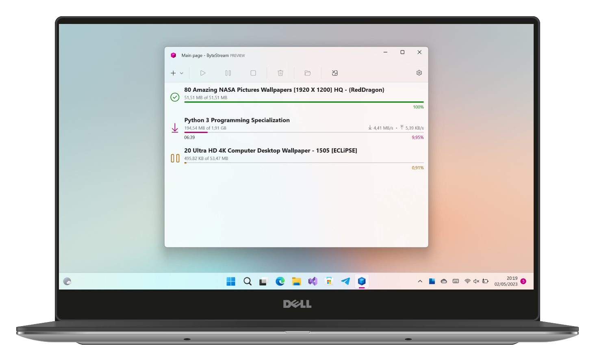

# ByteStream Torrent for Windows 11 (Feedback)
 
 

<a href="https://luandersonn.com/bytestream/">ByteStream Torrent</a> is a torrent client that makes it easy to download movies, music, games, software, ebooks and more. It has an intuitive interface and beautiful design. The app supports magnet links, so you can quickly find torrents without having to go through the hassle of searching manually.

## Help to Translate

### How to Translate
1. Download the language file you want to translate [here](translations/) or [request the file](https://github.com/luandersonn/TorrentClient-feedback/issues/new) if it does not exist.
2. Edit the file using an XLIFF editor. I recommend [Poedit](https://poedit.net/).
3. Upload the file to the repository.
4. Open a pull request.

| Code  | Language | Progress |
|------ |:--------:|-----:|
| en-US | English | base language |
| de-DE | German | 
| es-ES | Spanish | 
| fr-FR | French | 
| it-IT | Italian | 
| ja-JP | Japanese | 
| pt-BR | Portuguese | 
| ru-RU | Russian | 
| zh-CN | Simplified Chinese | 
| zh-TW | Traditional Chinese | 